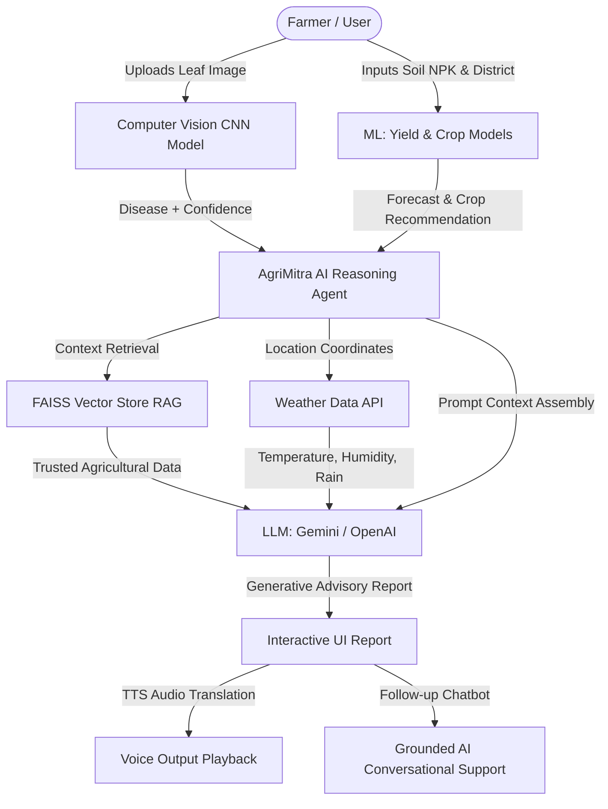

# 🌾 AgriMitra AI (कृषिमित्र एआई)

[](https://huggingface.co/spaces/Kowshik8501/AgriMitraAI)
[](https://github.com/kowshik-8501/AgriMitra-AI-)

> **Your Ultimate AI-Powered Smart Agriculture Companion & Plant Doctor**
> 
> 🚀 **Live App Link**: [https://kowshik8501-agrimitraai.hf.space/](https://kowshik8501-agrimitraai.hf.space/)
> 
> *A state-of-the-art web application powered by Deep Learning, Machine Learning, and Retrieval-Augmented Generation (RAG) to revolutionize farming decisions, disease diagnostics, and crop care.*

<p align="center">
  
</p>

---

## 🌟 Overview

**AgriMitra AI** is a premium, fully localized agricultural assistant designed to empower farmers, backyard gardeners, and agronomists. It integrates modern computer vision, predictive algorithms, and generative LLMs to make high-tech farming insights accessible to anyone, anywhere.

The application features a modern, responsive Glassmorphism UI with micro-animations and full multilingual support, including automated localization and voice output (Text-to-Speech) for seamless user interaction.

---

## 🏗️ System Architecture

AgriMitra AI integrates several machine learning and artificial intelligence tiers to deliver end-to-end insights:



---

## 🚀 Key Features

*   🔍 **AI Plant Disease Diagnosis**: Upload a picture of a crop leaf and instantly identify diseases using a custom PyTorch Convolutional Neural Network (CNN) trained on 38+ plant-disease categories. Get a diagnostic confidence percentage and immediate organic/chemical treatment advice.
*   💬 **Plant Doctor AI Chatbot (RAG)**: Ask free-form questions to a dedicated agricultural AI assistant. Using Retrieval-Augmented Generation (RAG) powered by **FAISS** and **Google Gemini/OpenAI API**, the bot answers questions grounded in a vetted crop-science database.
*   🌾 **Soil-Smart Crop Recommendation**: Input your soil's Nitrogen, Phosphorus, Potassium (NPK) levels, pH, and weather conditions (temperature, humidity, rainfall) to receive tailored crop recommendations powered by a trained Machine Learning model.
*   📈 **Harvest Yield Forecaster**: Predict expected crop yield in tons per hectare for your specific district using machine learning, backed by historical yield data and trend charts.
*   🧪 **Fertilizer & Soil Advisor**: Input NPK levels to get exact fertilizer recommendations (Urea, DAP, MOP) required to optimize soil quality for specific crops.
*   🗣️ **Voice & Multilingual Localization**: Fully localized in 7 languages: **English (en)**, **Hindi (hi)**, **Telugu (te)**, **Tamil (ta)**, **Kannada (kn)**, **Malayalam (ml)**, and **Odia (or)**. Includes dynamic audio translation via Text-to-Speech (TTS) for hands-free listening in the field.

---

## 🛠️ Technology Stack

| Component | Technology / Library |
| :--- | :--- |
| **Backend Framework** | FastAPI (ASGI Web Framework) |
| **Deep Learning** | PyTorch, Torchvision |
| **Machine Learning** | scikit-learn, joblib, pandas, numpy |
| **Generative AI & LLM** | Google Gemini API (2.5-Flash) & OpenAI API (GPT-4o-mini) |
| **Vector Search (RAG)** | FAISS CPU (IndexFlatIP), REST-based Embeddings |
| **Localization & Audio** | gTTS (Google Text-to-Speech), deep-translator |
| **Frontend UI** | HTML5, CSS3 (Glassmorphism, custom layout), Jinja2 Templates, Bootstrap 5 |
| **Containerization** | Docker, Hugging Face Spaces |

---

## 📁 Repository Structure

```files
├── app.py                      # Main FastAPI server and routing logic
├── predictor.py                # PyTorch CNN model loading & leaf image classifier
├── CNN.py                      # CNN architecture definitions and index maps
├── rag.py                      # FAISS vector database & context retriever
├── ai_agent.py                 # Gemini/OpenAI API wrapper & conversational Q&A agent
├── risk_model.py               # Weather API integrations & disease risk computations
├── requirements.txt            # Python environment packages and modules
├── Dockerfile                  # HF-compliant containerization build steps
├── .dockerignore               # Build context filter
├── .gitattributes              # Git LFS specifications for large weights
├── crop_model.pkl              # Scikit-learn model for crop recommendations
├── plant_disease_model_1_latest.pt  # PyTorch CNN trained weights (210MB)
├── vector_store.json           # Embedded knowledge base for RAG grounding
├── disease_info.csv            # Detailed treatments database
├── supplement_info.csv         # Vetted fertilizer product database
├── models/                     # Pickled sub-models for yield regressions
├── data/                       # CSV database tables for yield forecasting
├── static/                     # CSS, images, and runtime upload/audio folders
└── templates/                  # Bootstrap/Jinja2 HTML views (home, diagnostic reports)
```

---

## 💻 Local Development & Execution

To run AgriMitra AI on your local machine:

### 1. Prerequisites
Ensure you have **Python 3.10+** installed on your system.

### 2. Clone the Repository
```bash
git clone https://github.com/kowshik-8501/AgriMitra-AI-.git
cd "Flask Deployed App"
```

### 3. Install Dependencies
Create a virtual environment and install the required libraries (using the CPU index for PyTorch to save space):
```bash
python -m venv venv
source venv/bin/activate  # On Windows use: venv\Scripts\activate
pip install -r requirements.txt --extra-index-url https://download.pytorch.org/whl/cpu
```

### 4. Configure Environment Variables
Create a file named `.env` in the root folder:
```env
GEMINI_API_KEY=YOUR_GEMINI_API_KEY
OPENAI_API_KEY=YOUR_OPENAI_API_KEY
```

### 5. Launch the Server
```bash
python app.py
```
The application will start running at `http://localhost:8080`.

---

## ☁️ Hugging Face Spaces Deployment

AgriMitra AI is fully configured for deployment on **Hugging Face Spaces** using the Docker SDK. 

### 1. Stage and Commit Files
Make sure to add the modified Docker environment configs to Git:
```bash
git add Dockerfile README.md .dockerignore app.py templates/base.html templates/contact-us.html
git commit -m "Rename project to AgriMitra AI and optimize Docker for Hugging Face"
```

### 2. Initialize Git LFS (Large File Storage)
Large files like `plant_disease_model_1_latest.pt` (210MB) and `crop_model.pkl` must be pushed via LFS:
```bash
git lfs install
git push hf main
```

### 3. Add Environment Secrets on Hugging Face
For security, do not commit API keys to public repositories. Set them as secrets in your Hugging Face Space settings:
1. Open your Space: `https://huggingface.co/spaces/Kowshik8501/AgriMitraAI`
2. Navigate to **Settings** -> **Variables and secrets**.
3. Create two new variables:
   * `GEMINI_API_KEY`: *Your Gemini API Key*
   * `OPENAI_API_KEY`: *Your OpenAI API Key*
4. Hugging Face will automatically trigger a rebuild, and your Space will start running securely!

---

## 📜 License

This project is licensed under the MIT License. See `LICENSE` for details.